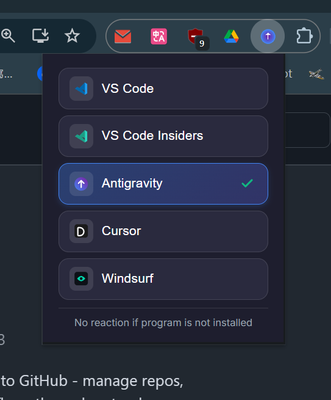
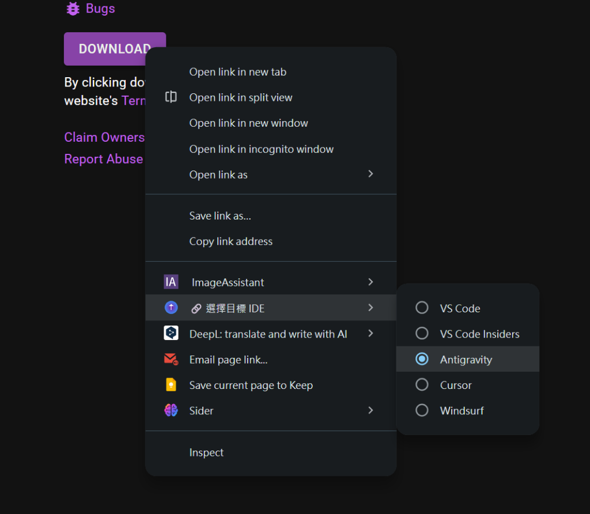
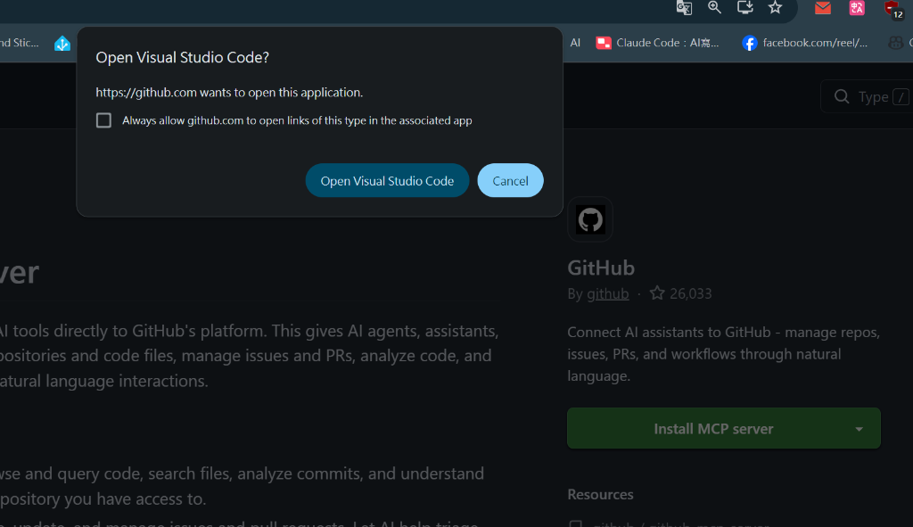

# IDE Link Interceptor

<div align="center">

[](https://github.com/pingqLIN/IDE-Link-Interceptor/actions/workflows/ci.yml)
[](https://opensource.org/licenses/MIT)

**攔截 IDE 協議連結並無縫切換至你慣用的編輯器**

[English](README.md) | [回報問題](https://github.com/pingqLIN/IDE-Link-Interceptor/issues) | [功能許願](https://github.com/pingqLIN/IDE-Link-Interceptor/issues)

</div>

---

## 📖 目錄

- [✨ 特色功能](#-特色功能)
- [📸 截圖預覽](#-截圖預覽)
- [🎯 支援的 IDE](#-支援的-ide)
- [📦 安裝方式](#-安裝方式)
- [🚀 使用教學](#-使用教學)
- [🧪 測試連結](#-測試連結)
- [🛠️ 開發指南](#-開發指南)

---

## ✨ 特色功能

- 🔗 **攔截 IDE 協議連結** - 自動捕捉網頁上的 `vscode://`、`cursor://`、`windsurf://` 等連結
- 🎯 **選擇你的 IDE** - 透過 Popup 視窗或右鍵選單，輕鬆選擇要開啟的編輯器
- 🚀 **消除瀏覽器提示** - 不再顯示惱人的「開啟 Visual Studio Code？」確認視窗
- 📦 **擴充套件與 VSIX 支援** - 在你選擇的 IDE 中開啟擴充頁面；右鍵點擊 `.vsix` 檔案直接安裝
- 🔧 **MCP Server 安裝支援** - 攔截 MCP 安裝連結（包含 Cursor 特殊的 deeplink 格式）並重新導向至你的 IDE
- 💾 **自動記憶選擇** - 系統會自動記住你上次使用的 IDE，無需重複選擇
- 🌐 **多語言支援** - 介面自動切換繁體中文或英文（依據瀏覽器設定）

> **注意：** 當你在 VS Code Marketplace 點擊「Install」安裝擴充套件時，擴充頁面會在你選擇的 IDE 中開啟。由於所有 VS Code 系列 IDE 的安全性限制，你需要在 IDE 內再點擊一次「安裝」按鈕才能完成安裝。

## 📸 截圖預覽

| Popup 介面 | 右鍵選單整合 |
|:---:|:---:|
|  |  |
| *點擊擴充功能圖示選擇 IDE* | *右鍵點擊連結進行特定操作* |

### 使用前：瀏覽器確認視窗

<div align="center">
  
  <br/>
  <em>沒有安裝擴充功能時，每次點擊都會跳出這個視窗</em>
</div>

## 🎯 支援的 IDE

| IDE | 協議 | 說明 |
| :--- | :--- | :--- |
| **VS Code** | `vscode://` | 官方穩定版 |
| **VS Code Insiders** | `vscode-insiders://` | 預覽測試版 |
| **Antigravity** | `antigravity://` | Antigravity 專用 IDE |
| **Cursor** | `cursor://` | AI 優先的新世代 IDE |
| **Windsurf** | `windsurf://` | 搭載 Codeium 的 IDE |

## 📦 安裝方式

### Chrome / Edge

1. 在網址列輸入 `chrome://extensions/`（Edge 為 `edge://extensions/`）
2.開啟右上角的「**開發人員模式**」開關
2. 點擊左上角的「**載入未封裝項目**」
3. 選擇 `extension/`（包含 `manifest.json` 的資料夾）

### 從原始碼安裝

```bash
# 複製專案
git clone https://github.com/pingqLIN/IDE-Link-Interceptor.git
cd IDE-Link-Interceptor

# 安裝依賴套件
npm install

# 驗證擴充功能
npm run validate
```

## 🚀 使用教學

### 方法一：擴充功能 Popup

1. 點擊瀏覽器工具列上的 IDE Link Interceptor 圖示。
2. 從清單中點擊你想使用的 IDE。
3. 系統會自動儲存你的選擇。

### 方法二：右鍵選單

1. 在任意連結或網頁空白處按滑鼠右鍵。
2. 移至「**🔗 選擇目標 IDE**」。
3. 點選你偏好的 IDE。

> **注意：** 選單文字會根據你的瀏覽器語言自動顯示中文或英文。

### 方法三：安裝 VSIX 擴充套件

1. 在 `.vsix` 下載連結上按右鍵。
2. 點擊「**📦 用 \[IDE 名稱\] 安裝此擴充套件**」。
3. 該套件將會自動在你選擇的 IDE 中開啟安裝。

### 方法四：從 Marketplace 安裝擴充套件

當你在 VS Code Marketplace 或類似網站點擊「Install」時：

1. 本擴充功能會攔截 `vscode:extension/...` 連結。
2. 自動轉換協議至你的目標 IDE（例如 `antigravity:extension/...`）。
3. 你的 IDE 會開啟並顯示該擴充套件的頁面。
4. 在 IDE 內點擊「安裝」即可完成安裝。

> **為什麼需要多點一次？** 所有 VS Code 系列 IDE 基於安全考量，都不支援透過 protocol URL 自動安裝擴充套件。這是平台限制，並非本擴充功能的問題。

## 🧪 測試連結

你可以利用以下網站測試本擴充功能的效果：

- [GitHub MCP](https://github.com/mcp) - 嘗試點擊「Install MCP server」等按鈕
- [VS Code Marketplace](https://marketplace.visualstudio.com/) - 點擊各擴充套件頁面的「Install」按鈕
- [Open VSX Registry](https://open-vsx.org/) - 嘗試下載 `.vsix` 檔案

## 🛠️ 開發指南

擴充元件執行期檔案位於 `extension/`；可參考 `docs/project-structure.md` 與 `docs/global-workflow.md`。

### 環境建置

```bash
# 安裝依賴
npm install

# 執行程式碼檢查 (Linting)
npm run lint

# 自動修正程式碼風格
npm run lint:fix

# 驗證 manifest.json 正確性
npm run validate

# 打包擴充功能 (.zip)
npm run package
```

### CI/CD 自動化流程

本專案使用 GitHub Actions 進行自動化建置與發布：

#### CI 流程 (Push / Pull Request)

1. **程式碼檢查** - ESLint 品質把關
2. **Manifest 驗證** - 確保設定檔格式正確
3. **打包** - 自動產生 .zip 檔案
4. **保存產物** - 上傳至 Artifacts 供下載測試

#### Release 流程 (推送 Tag)

當推送版本標籤（如 `v1.4.0`）時：

1. 執行所有 CI 檢查
2. 打包擴充功能
3. 自動建立 GitHub Release 並附上安裝檔

### 建立新版本

```bash
# 1. 確認 manifest.json 與 package.json 版本號已更新
# 2. 建立標籤並推送
git tag v1.4.0
git push origin v1.4.0
```

## 📄 授權 (License)

MIT License. 詳見 `LICENSE` 文件。

---

Made with ❤️ by [pingqLIN](https://github.com/pingqLIN)
